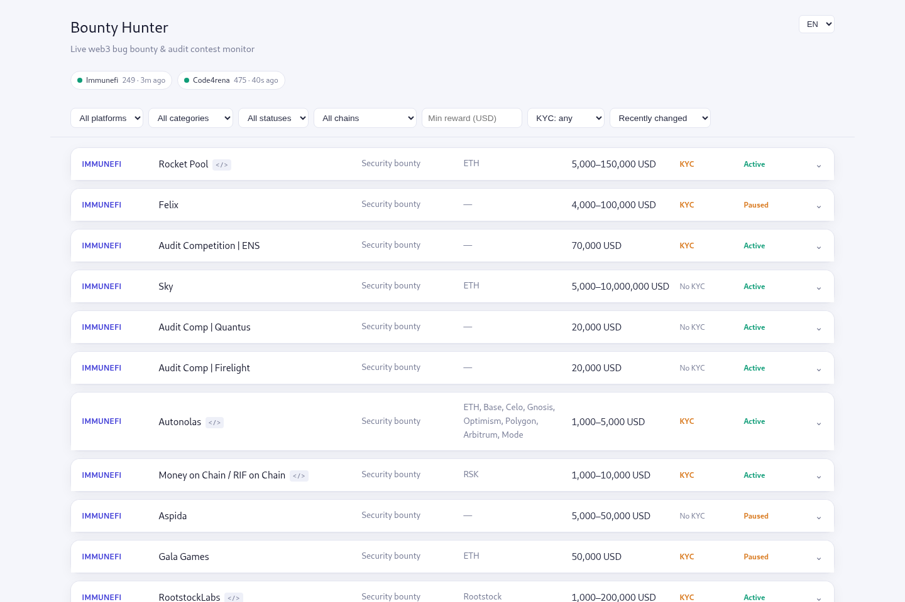

# Bounty Hunter

Real-time monitor for web3 bug-bounty, audit-contest, and grant-bounty programs. Aggregates multiple platforms into one live dashboard: new programs, reward changes, and closures show up as they happen.



## Stack

- `frontend/` — Vue 3 + TypeScript (Vite), Pinia, Vue Router
- `backend/` — Fastify + TypeScript, SQLite (`better-sqlite3` + Drizzle ORM), WebSocket for live updates

## Data sources

| Platform                                                   | Status                                        |
| ---------------------------------------------------------- | --------------------------------------------- |
| Immunefi                                                   | live (community JSON mirror)                  |
| Code4rena                                                  | live (official API)                           |
| Gitcoin, Sherlock, Cantina, HackenProof, HackerOne, Layer3 | planned — see `backend/src/adapters/index.ts` |

## Development

```sh
pnpm install
pnpm dev
```

This starts the backend (port 3001, runs DB migrations on boot and begins polling registered adapters) and the frontend (Vite dev server, proxies `/api/*` to the backend) together.

- Dashboard: http://localhost:5173
- API health check: http://localhost:3001/api/health
- Live event stream: connects over WebSocket at `ws://localhost:3001/api/events`

## Testing

```sh
pnpm run test        # backend (vitest, real temp-file SQLite + migrations) + frontend (vitest)
pnpm run typecheck    # tsc (backend) + vue-tsc (frontend)
pnpm run lint
```

Backend tests cover the poll-diffing engine (`src/diff/engine.ts` — new/changed/closed detection and the events it
records), the code4rena/translate parsing and batching logic, the WS connection cap, the AI-summary daily budget
cap, and the `/api/programs` routes (including the closed-programs default filter) via Fastify's `inject()`, all
against a disposable temp-file database created fresh per test file. Frontend tests cover the programs store's
filtering/sorting logic with the API layer mocked. CI (`.github/workflows/ci.yml`) runs lint, format check,
typecheck, tests, the production build, and a Docker image build on every push/PR.

## Database

SQLite file lives at `backend/data/bounties.db` (gitignored). Schema changes: edit `backend/src/db/schema.ts`, then `pnpm --filter backend run db:generate` to create a migration; migrations apply automatically on backend startup.

## Docker

```sh
cp backend/.env.example backend/.env   # fill in DEEPSEEK_API_KEY if you want AI summaries
docker compose up -d --build
```

- Frontend (nginx, serves the built SPA and proxies `/api/*` and the `/api/events` WebSocket to the backend): http://localhost
- If port 80 is already taken on the host (common on a dev machine), set `FRONTEND_PORT` instead of editing the compose file: `FRONTEND_PORT=8080 docker compose up -d`, then open http://localhost:8080. Same knob applies when putting this behind your own TLS-terminating reverse proxy on a different port.
- The backend container publishes no ports; it's reachable only from the `frontend` container over the internal compose network.
- The SQLite file lives in the `db-data` named volume, never in an image layer or a host bind mount. Back it up with:
  ```sh
  docker compose exec backend sh -c "sqlite3 \$DB_PATH '.backup /tmp/backup.db'" && docker compose cp backend:/tmp/backup.db ./backup.db
  ```
- Both containers run read-only root filesystems, as non-root users, with all Linux capabilities dropped.
- There is no TLS termination in this compose file -- put a reverse proxy (or your platform's load balancer) in front of the `frontend` service for HTTPS in a real deployment.
- To demo without exposing the host's real IP (no domain needed): `docker compose --profile tunnel up -d` also
  starts a Cloudflare Quick Tunnel; grab the generated `https://*.trycloudflare.com` URL from
  `docker compose logs tunnel`. It changes if that container restarts, and it's meant for light demo traffic, not
  sustained production load. If you use it, firewall the host itself (e.g. Hetzner's Cloud Firewall) to drop
  inbound 80/443 — the tunnel only makes an outbound connection out, so nothing needs to be open for it to work,
  and leaving those ports open defeats the point of hiding the host.
- Sharing the host with other projects? Deploy with
  `docker compose -f docker-compose.yml -f docker-compose.tunnel-only.yml --profile tunnel up -d --build` instead --
  it removes the frontend's host port publish entirely (verified: `docker compose ... config` shows no `ports:` key
  for `frontend`, and the container comes up with nothing bound on the host side), so there's no port for it to
  conflict with, no matter what else is running. The project name is also pinned (`name: bountyhunter` at the top
  of `docker-compose.yml`), so its containers/network/volume names can't collide with another project even if it
  happens to be checked out into a same-named directory. Before deploying anything new to a host you don't fully
  know the state of, it's still worth checking directly rather than assuming: `docker ps -a` (existing
  containers/project names), `docker network ls` (existing Compose projects), `sudo ss -ltnp` (ports already
  listening on the host), and `free -h` / `docker stats` (memory headroom).

## Deploying

`.github/workflows/ci.yml`'s `deploy` job pushes to a server over SSH whenever something lands on `main` (and lint,
typecheck, tests, the build, and the Docker image build have all passed first -- it `needs: [checks, docker]`, so a
broken push never reaches the server). It runs `scripts/deploy.sh`, which rebuilds and restarts the stack via the
tunnel-only override, waits for both containers to report healthy, and prunes dangling images left by the rebuild;
it exits non-zero (failing the workflow) if either container doesn't go healthy within 60s.

One-time setup on the server:

```sh
git clone <this repo> ~/bountyhunter && cd ~/bountyhunter
cp backend/.env.example backend/.env   # fill in DEEPSEEK_API_KEY
```

Then add these repo secrets (Settings → Secrets and variables → Actions):

| Secret                    | Value                                                                             |
| ------------------------- | --------------------------------------------------------------------------------- |
| `DEPLOY_HOST`             | server IP or hostname                                                             |
| `DEPLOY_USER`             | SSH user (a dedicated deploy user in the `docker` group, not root, is worth it)   |
| `DEPLOY_SSH_KEY`          | private key of a dedicated deploy keypair (`ssh-keygen -t ed25519 -f deploy_key`) |
| `DEPLOY_HOST_FINGERPRINT` | optional; output of `ssh-keyscan -t ed25519 <host>`, pins the host key            |

Add the deploy keypair's _public_ half to that user's `~/.ssh/authorized_keys` on the server. Trigger a deploy
manually (without a new commit) from the Actions tab via `workflow_dispatch`.

## License

[MIT](LICENSE)
